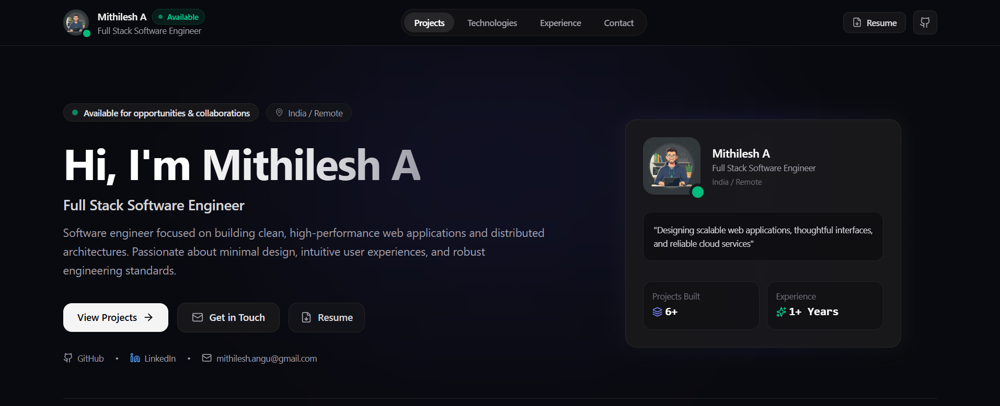

# Mithilesh A - Portfolio

**Software Engineer · Full-Stack Developer**

I build scalable web applications, backend services, and AI-powered systems with a focus on clean architecture, reliability, and practical engineering.

---

## 🌟 Demo & Preview

<div align="center">
  
</div>

---

## 🌐 Live Demo

[](https://mithilesh-portfolio-lyart.vercel.app/)

🚀 **[Launch mithiesh-portfolio](https://mithilesh-portfolio-lyart.vercel.app/)**

> The application is hosted on Vercel.
---

### 🎯 Project Structure

```bash
mithilesh-portfolio/
├── public/
│   └── profile_avatar.jpg
│
├── src/
│   ├── assets/                    # Local assets and visual resources
│   │
│   ├── components/                # Reusable UI components
│   │   ├── AdminPortalModal.tsx
│   │   ├── ExperienceSection.tsx
│   │   ├── Footer.tsx
│   │   ├── Hero.tsx
│   │   ├── Navbar.tsx
│   │   ├── ProjectCard.tsx
│   │   ├── ProjectDetailModal.tsx
│   │   └── TechStackSection.tsx
│   │
│   ├── data/                      # Portfolio content and default data
│   │   └── defaultData.ts
│   │
│   ├── services/                  # External API and service integrations
│   │   └── ...
│   │
│   ├── utils/                     # Shared utilities and helpers
│   │   ├── exportCodeGenerator.ts
│   │   └── techLogos.ts
│   │
│   ├── App.tsx                    # Application state and routing
│   ├── index.css                  # Global styles
│   ├── main.tsx                   # Application entry point
│   ├── types.ts                   # TypeScript type definitions
│   └── vite-env.d.ts
│
├── .env.example
├── .gitignore
├── index.html
├── metadata.json
├── package.json
├── package-lock.json
├── README.md
├── tsconfig.json
└── vite.config.ts
```

---

## 🧩 Portfolio Sections

The portfolio is organized around key areas of software engineering:

- **⚡ Introduction** — Professional introduction with resume access and GitHub, LinkedIn, and email links.

- **📁 Projects & Architecture** — Interactive project showcase with category filtering, system architecture diagrams, technical decisions, engineering trade-offs, bottlenecks, and GitHub metrics.

- **🛠️ Tech Stack** — Categorized technology and skill matrix with interactive navigation and technology icons.

- **💼 Experience** — Interactive career timeline highlighting responsibilities, achievements, and engineering impact.

- **🔒 Admin Portal** — Built-in portfolio editor with multiple access methods and one-click code export for maintaining the portfolio without a database or external CMS.

---

## 💻 Technologies Used

- **Frontend Core:** React 18 with TypeScript & Vite
- **Styling:** Tailwind CSS
- **Icons:** Lucide React & Devicon CDN
- **Code Export Engine:** Custom in-memory TypeScript AST generator
- **Deployment:** Vercel

---

## ⬇️ Installation & Setup

You will need **Git** and **Node.js** (v18+) to run this project locally.

### 1. Git & Node Check

```bash
# Check Git version
git --version

# Check Node.js version
node --version
```

---

## 🎯 Getting Started

### 1. Clone the Repository 🚀
```bash
git clone https://github.com/mithileshh/portfolio.git
```

### 2. Navigate to the Project Directory 📂
```bash
cd portfolio
```

### 3. Install Dependencies ⚙️
```bash
npm install
```

### 4. Run the Local Development Server 🚀
```bash
npm run dev
```

### 5. View the Project 🌐
Open your browser and visit **`http://localhost:3000`** (or the port shown in your terminal).

---

## 🏗️ Building for Production

To create an optimized, production-ready static build:

```bash
npm run build
```

The compiled output will be generated inside the `dist/` directory, ready to deploy to Vercel or any static host.

---

## 📬 Contact & Socials

- **Developer**: Mithilesh A
- **Email**: [mithilesh.angu@gmail.com](mailto:mithilesh.angu@gmail.com)
- **LinkedIn**: [linkedin.com/in/mithilesh-angu](https://www.linkedin.com/in/mithilesh-a-/)
- **GitHub**: [github.com/mithileshh](https://github.com/mithileshangu)

---

## 📝 License
This project is open source and available under the [MIT License](LICENSE).

---
## 👨‍💻 Author

**Mithilesh A**

Software Developer
---
